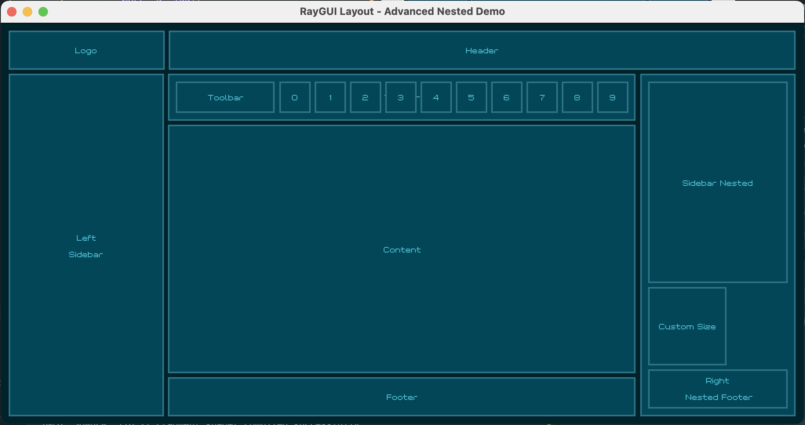
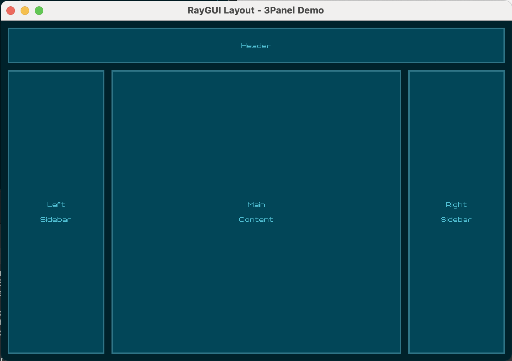

# RGLayout - A Simple Flex Layout Library for Raylib & Raygui (C)



A lightweight immediate-mode layout library for building flexible UIs with Raylib. Made for creating responsive layouts without manual positioning.

## Why?
- Simple immediate mode flex layout library with minimal internal state
- Ray's been looking for a good layout library for Raygui (potentially official integration)
- I wanted to build advanced faster that look good without manual positioning calculation and boilerplate
- Originally written in Odin for my spectrum analyzer [spectro](https://github.com/grplyler/spectro)

## Design Goals
- Favor Intuitiveness and Simplicity over Advanced Features
- Immediate Mode
- Intelligent, Declarative Layouts
- Raylib Style

## Features
- [x] Simple Rows and Columns (horizontal/vertical containers)
- [x] Easy Stack-based nested layouts
- [x] Simple API (4 core functions + helpers)
- [x] Resizable and Auto-adjusting
- [x] Mix flexbox-like and fixed sizes
- [x] Vertical and Horizontal Alignment
- [x] Tiny (core features less than 1k lines of code)
- [x] Header-only C library
- [x] Fast stack-based layout computation

## Planned
- [ ] Improved vertical and horizontal alignment options (without overcomplicating things)
- [ ] Review by Raysan5
- [ ] Unit tests
- [ ] Standalone mode (easy contribute)
- [ ] Windows build test (east contribute)
- [ ] Profiling code for `GuiLayoutRec` (easy contribute)

## Quick Start

Just a few lines of code gets you a nice layout. Include the header and define the implementation:

```c
#define RGLAYOUT_IMPLEMENTATION
#include "rglayout.h"
```

### Simple Login Form Example

```c
#define RAYGUI_IMPLEMENTATION
#include "raygui.h"

#define RGLAYOUT_IMPLEMENTATION
#include "rglayout.h"

int main(void) {
    InitWindow(400, 300, "Login Form");
    SetTargetFPS(60);

    char username[32] = {0};
    char password[32] = {0};
    bool username_edit = false;
    bool password_edit = false;

    // Configure layout defaults
    RGLSetDefaultGap(10.0f);
    RGLSetDefaultPadAll(10.0f);

    while (!WindowShouldClose()) {
        BeginDrawing();
        ClearBackground(RAYWHITE);

        Rectangle screen = {0, 0, GetScreenWidth(), GetScreenHeight()};

        // Main column container
        GuiBeginColumn(screen, NULL);

            // Username row
            GuiBeginRow(GuiLayoutRec(50, -1), NULL);
                GuiLabel(GuiLayoutRec(75, -1), "Username:");
                if (GuiTextBox(GuiLayoutRec(-1, -1), username, 32, username_edit))
                    username_edit = !username_edit;
            GuiLayoutEnd();

            // Password row
            GuiBeginRow(GuiLayoutRec(50, -1), NULL);
                GuiLabel(GuiLayoutRec(75, -1), "Password:");
                if (GuiTextBox(GuiLayoutRec(-1, -1), password, 32, password_edit))
                    password_edit = !password_edit;
            GuiLayoutEnd();

            // Centered login button
            RGLPlan login_plan = GuiPlanCreate((float[]){-1, 100, -1}, 3);
            GuiBeginRow(GuiLayoutRec(50, -1), &login_plan);
                GuiLayoutRec(-1, -1); // spacer
                GuiButton(GuiLayoutRec(-1, -1), "Login");
                GuiLayoutRec(-1, -1); // spacer
            GuiLayoutEnd();

        GuiLayoutEnd();

        EndDrawing();
    }

    CloseWindow();
    return 0;
}
```


### 3-Panel Layout Example

```c
// Three-panel layout: sidebar, content, properties
GuiBeginRow(screen_rect, NULL);

    // Left sidebar (200px fixed)
    GuiBeginColumn(GuiLayoutRec(200, -1), NULL);
        GuiButton(GuiLayoutRec(-1, 40), "File");
        GuiButton(GuiLayoutRec(-1, 40), "Edit");
        GuiButton(GuiLayoutRec(-1, 40), "View");
        // Remaining space is empty
    GuiLayoutEnd();

    // Main content area (flexible)
    GuiBeginColumn(GuiLayoutRec(-1, -1), NULL);
        GuiButton(GuiLayoutRec(-1, 50), "Toolbar");

        // Content area
        Rectangle content = GuiLayoutRec(-1, -1);
        DrawRectangleRec(content, LIGHTGRAY);
        GuiLabel(content, "Main Content Area");

    GuiLayoutEnd();

    // Right properties panel (250px fixed)
    GuiBeginColumn(GuiLayoutRec(250, -1), NULL);
        GuiLabel(GuiLayoutRec(-1, 30), "Properties");
        GuiSlider(GuiLayoutRec(-1, 30), "Size", NULL, 0, 100);
        GuiColorPicker(GuiLayoutRec(-1, 150), NULL, WHITE);
    GuiLayoutEnd();

GuiLayoutEnd();
```



### Nested Example


Source Code: [examples/nested.c]

## API Reference

### Core Functions

**Container Creation**
```c
void GuiBeginRow(Rectangle bounds, RGLPlan *plan);
void GuiBeginColumn(Rectangle bounds, RGLPlan *plan);
void GuiLayoutEnd(void);
```
- `GuiBeginRow`: Start horizontal container (left → right)
- `GuiBeginColumn`: Start vertical container (top → bottom)
- `GuiLayoutEnd`: End current container (call once per Begin)

**Getting Child Rectangles**
```c
Rectangle GuiLayoutRec(float main, float cross);
Rectangle GuiLayoutRecEx(float main, float cross, float pl, float pr, float pt, float pb, RGLAlign valign, RGLAlign halign);
// coming soon: Rectangle GuiLayoutRecVAlign(float main, float cross, RGLAlign valign);
// coming soon: Rectangle GuiLayoutRecHAlign(float main, float cross, RGLAlign halign);
// coming soon: Rectangle GuiLayoutRecAlign(float main, float cross, RGLAlign valign, RGLAlign halign);
```

**Parameters:**
- `main`: Size along main axis (width for rows, height for columns)
  - `>= 0`: Fixed pixel size
  - `-1`: Use plan entry or fill remaining space
- `cross`: Size along cross axis (height for rows, width for columns)
  - `>= 0`: Fixed pixel size
  - `< 0`: Fill available cross-axis space
- Padding: `pl`, `pr`, `pt`, `pb` (left, right, top, bottom)
- Alignment: `RGL_ALIGN_TOP`, `RGL_ALIGN_CENTER`, `RGL_ALIGN_BOTTOM`, `RGL_ALIGN_LEFT`, `RGL_ALIGN_RIGHT`, `RGL_ALIGN_NONE`

### Plan System

Create layout plans to define child sizing:

```c
RGLPlan GuiPlanCreate(const float *sizes, int length);
void GuiPlanAdd(RGLPlan *plan, float size);
void GuiPlanSetGap(RGLPlan *plan, float gap);
void GuiPlanSetPad(RGLPlan *plan, RGLPad pad);
```

**Plan Values:**
- `>= 20`: Fixed pixels
- `0 < v < 20`: Flex weight (proportional sizing)
- `-1`: Fill remaining space (flex weight = 1)
- `< -1`: Ignored (zero size)

**Examples:**
```c
// Fixed sizes: 100px, 200px, 150px
RGLPlan fixed = GuiPlanCreate((float[]){100, 200, 150}, 3);

// Flex ratios: 1:2:1 (proportional)
RGLPlan flex = GuiPlanCreate((float[]){1, 2, 1}, 3);

// Mixed: 100px fixed, fill remaining, 50px fixed
RGLPlan mixed = GuiPlanCreate((float[]){100, -1, 50}, 3);
```

### Configuration

```c
void RGLSetDefaultGap(float g);
void RGLSetDefaultPadAll(float p);
void RGLSetDefaultVAlign(RGLAlign align);
void RGLSetDefaultHAlign(RGLAlign align);
```

### Padding Helpers

```c
RGLPad RGLPadAll(float p);
RGLPad RGLPadX(float x);      // left & right
RGLPad RGLPadY(float y);      // top & bottom
RGLPad RGLPadL(float x);      // left only
RGLPad RGLPadR(float x);      // right only
```

### Utility Functions

```c
Rectangle GuiLayoutRecLast(void);  // Get last returned rectangle
Rectangle GuiLayoutPanel(float main, float cross, float pad_top, float pad_other, RGLPad *out_pad);
```

## Layout Modes

**Ad-hoc Mode** (no plan):
```c
GuiBeginRow(bounds, NULL);
    GuiButton(GuiLayoutRec(100, -1), "Fixed 100px");
    GuiButton(GuiLayoutRec(-1, -1), "Fill remaining");
GuiLayoutEnd();
```

**Planned Mode** (with plan):
```c
RGLPlan plan = GuiPlanCreate((float[]){1, 2, 1}, 3); // 1:2:1 ratio
GuiBeginRow(bounds, &plan);
    GuiButton(GuiLayoutRec(-1, -1), "25%");  // Uses plan[0] = 1
    GuiButton(GuiLayoutRec(-1, -1), "50%");  // Uses plan[1] = 2
    GuiButton(GuiLayoutRec(-1, -1), "25%");  // Uses plan[2] = 1
GuiLayoutEnd();
```

## Building

```
git clone https://github.com/grplyler/rglayout.git
git submodule update --init --recursive
cmake -B build
cmake --build build
```

## Run Demos

```
./build/nested-demo
```

## Contributed

Feel free to submit a pull request! Trying to keep things super simple, but you may find a better way to do things!

## Tips

- Use small numbers (1,2,3) for flex ratios
- Use values >= 20 for exact pixel sizes
- Negative cross values fill available space
- Stack containers for complex layouts
- Set defaults once, override per-widget as needed
